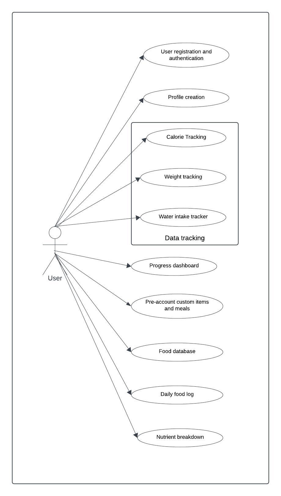
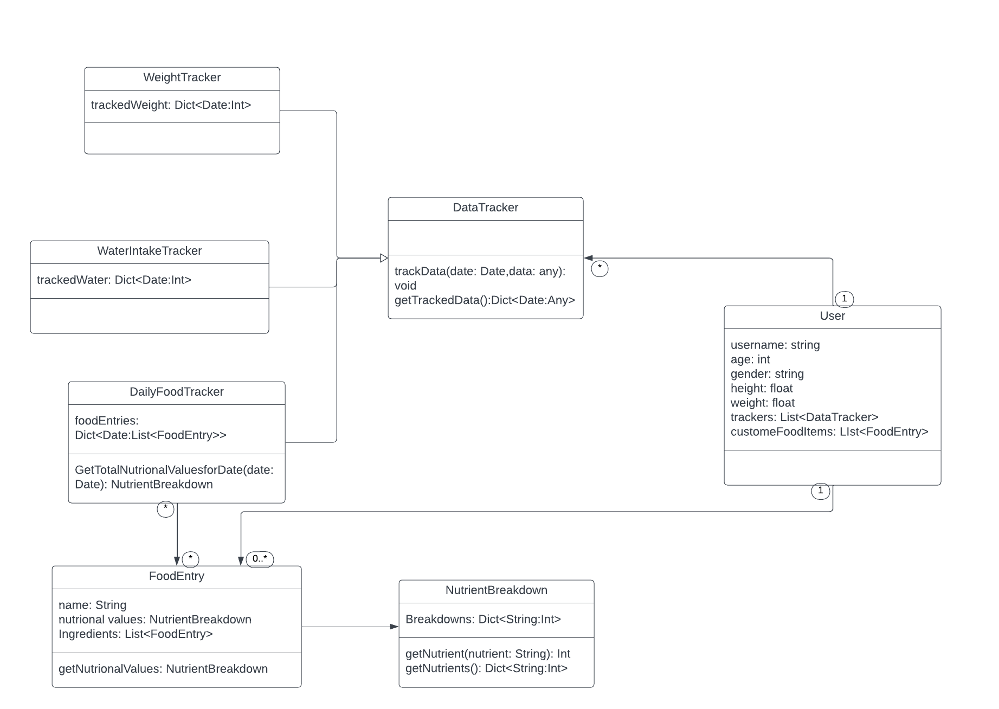

# PROJECT Design Documentation

## Team Information
* Team name: CAZAM
* Team members
  * Collin Cleary
  * Abdul Ahad Khan
  * Aitan Bachrach
  * Muskan Shah
  * Zaige Shi

## Executive Summary

Nutrition Tracker is a web app where account holders can track their meals, nutrition details, calorie count, water intake, and weight. 

## Requirements

This section describes the features of the application.

### Definition of MVP
  * user registration and authentication
  * profile creation
  * daily food log
  * calorie tracking
  * nutrient breakdown
  * water intake tracker
  * weight tracking
  * progress dashboard
  * food database
  * per-account custom items and meals

### MVP Features
* Epic: User Registration and Authentication
  * Story: Implement user registration functionality
  * Story: Implement user login functionality

* Epic: Profile Creation
  * Story: Allow users to create their profiles with basic information (e.g., name, age, gender)
  * Story: Implement profile editing functionality

* Epic: Daily Food Log
  * Story: Allow users to log their daily food intake
  * Story: Enable users to view and edit their food logs

* Epic: Calorie Tracking
  * Story: Implement calorie tracking based on logged food items
  * Story: Display daily calorie consumption to the user

* Epic: Nutrient Breakdown
  * Story: Calculate and display nutrient breakdown (e.g., protein, carbohydrates, fat) based on logged food items

* Epic: Water Intake Tracker
  * Story: Enable users to log their daily water intake
  * Story: Display daily water intake progress

* Epic: Weight Tracking
  * Story: Allow users to log their weight regularly
  * Story: Display weight tracking graph/chart

* Epic: Progress Dashboard
  * Story: Create a dashboard to visualize user's progress over time (e.g., weight loss/gain, calorie intake)

* Epic: Food Database
  * Story: Implement a database of commonly consumed foods with their nutritional information

## Architecture and Design

This section describes the application architecture.

### Software Architecture

We will be using a Model-View-Controller architecture for our system. The view will be done using the React framework for HTML/JS/CSS. It will be responsible for displaying the information to the user and capturing their inputs. The inputs will then be used by the controller to either change the page that is being displayed to the user and show them new information or to further process data such as text inputs. Information that needs to be stored will be captured by the controller and sent over HTTPS requests to a Node.JS backend utilizing a REST API. This data will be processed into a form that allows for easy storage and retrieval as nessecary and stored in a MongoDB database. Examples of information that might be stored would be user logins, user logs and goals, and detailed food information. The backend would also handle any sensitive or complex processing such as user authentication or modeling. Due to the design of our system all information requests to display will flow from the view to the controller then to the model then back up since out backend and database will be one in the same.
### Use Cases

In the use case diagram, there is one actor: User. There're ten use cases for user. At the beginning, user should register an account and log in with user name and password, and that's 'User registration and authentication'  use case. After that, it can modify the profile of the account. Then user can track data for calorie, water intake and weight. The application provide user with a graphic dashboard showing the daily progress. The application has nutrition data for common food items which user can add them into their daily food log. It also allows users to create and save their own food item._

### Class Diagram

Our system will have a User object which will hold a user's personal data 
including their tracked health information and custom food items

Several functional elements of our application will be composed of "DataTrackers"
which are responsible for dates, times, and values of entries relevant to their specifications

So far we have a weight tracker, water intake tracker, and daily food tracker. Weight tracker and water intake tracker will
be fairly straight forward. Daily Food tracker will interact with FoodEntry objects.

Food entries themselves can contain ingredients (other food entries)
and a nutrient breakdown.

NutrientBreakdown objects are a collection of nutritional information similar to a 
miniature digital nutrition label